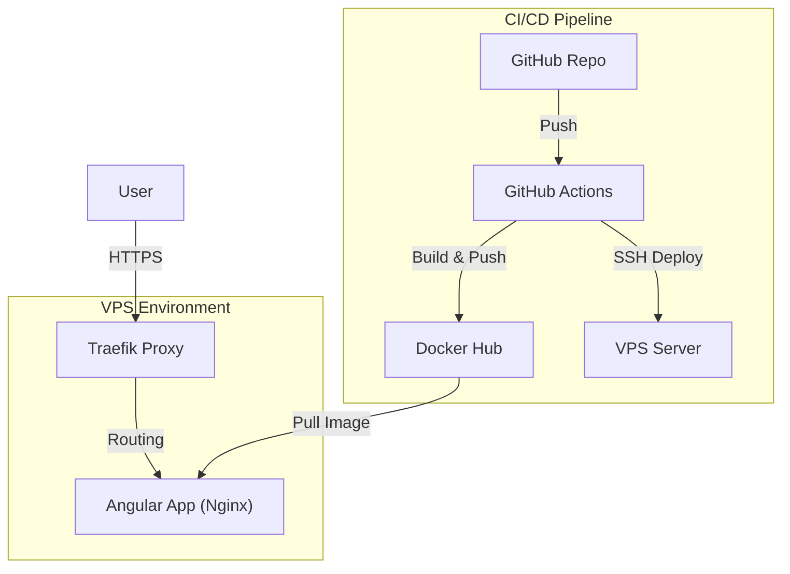

# My Portfolio Website

Modern developer portfolio built with Angular 19, featuring a unique NieR: Automata-inspired design.

🔗 **Live Demo**: [portfolio.cavydev.com](https://portfolio.cavydev.com)

## Tech Stack

- **Angular 19** with TypeScript
- **Tailwind CSS** for styling
- **Docker** for containerization
- **GitHub Actions** for CI/CD pipeline
- **Traefik** for reverse proxy & TLS

## Key Features

- Responsive design optimized for all devices
- Custom UI components with smooth animations
- Interactive project showcases with detailed case studies
- High performance (95+ Lighthouse score)
- Accessible design following WCAG guidelines

## Quick Start (Local)

```bash
git clone https://github.com/adam-benyekkou/my_portfolio.git
cd my_portfolio
npm install
ng serve
```

## Architecture



## Deployment Architecture

This project uses a fully automated **CI/CD pipeline** via GitHub Actions to deploy to a VPS.

### 1. Docker & Traefik

The application is containerized using `nginx:alpine`. It allows for an **Image-Based Deployment**:

- **GitHub Actions** builds the image and pushes to Docker Hub (`cavydev/my-portfolio`).
- **VPS** pulls the image and runs it.
- **Traefik** handles routing and SSL certificates automatically via labels in `docker-compose.yml`.

### 2. GitHub Secrets

To replicate the deployment, the following secrets are required in GitHub:

- `DOCKER_USERNAME` / `DOCKER_PASSWORD`: For pushing/pulling images.
- `SSH_HOST` / `SSH_USER` / `SSH_KEY`: For connecting to the VPS.

### 3. Pipeline Flow

1. **Push to Master**: Triggers the pipeline.
2. **Quality Check**: Runs `npm run lint` and security scans (Trivy).
3. **Build & Push**: Builds Docker image -> Docker Hub.
4. **Deploy**: SSHs into VPS, pulls the new image, and restarts the container.

## Contact

**Adam Benyekkou**  
Portfolio: [portfolio.cavydev.com](https://portfolio.cavydev.com)  
LinkedIn: [linkedin.com/in/adambnk](https://www.linkedin.com/in/adambnk/)  
GitHub: [@adam-benyekkou](https://github.com/adam-benyekkou)
